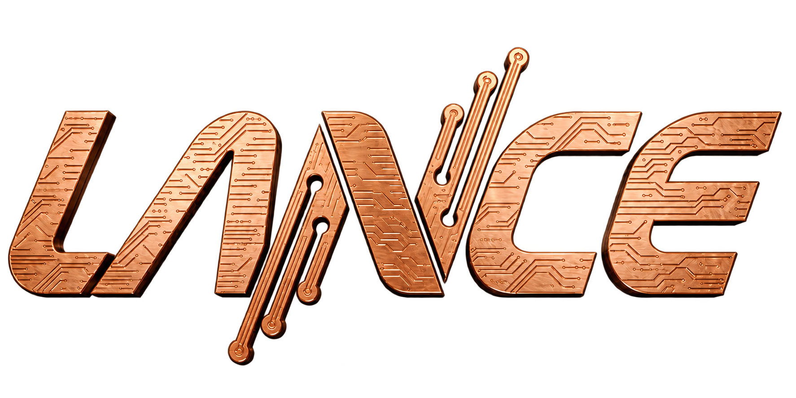

<p align="center">
  
</p>

# LANCE Metrics

**Experimentos de rede e transmissão de vídeo em uma única plataforma.**

O LANCE Metrics permite configurar, executar e analisar experimentos TCP/UDP
com iperf3 e transmissões de vídeo UDP/RTP. A interface web reúne configuração,
acompanhamento, visualização de vídeo, gráficos e exportação de resultados.
A mesma aplicação funciona como cliente ou servidor, em containers Docker
ou diretamente no sistema operacional.

Desenvolvido por **[Paulo Eugenio da Costa Filho](https://github.com/pauloeugenio)**.

## Funcionalidades

| Módulo | O que oferece |
| --- | --- |
| Dashboard | Estado da aplicação, experimentos e informações de rede. |
| Experimentos TCP/UDP | Configuração de destino, duração, protocolo e fluxos iperf3. |
| Servidor iperf3 | Inicialização, parada e acompanhamento do servidor. |
| Perfis de tráfego | Experimentos organizados em etapas com parâmetros próprios. |
| Video Streaming | Upload de vídeos, fila, envio sequencial ou concorrente e recepção. |
| Configuração do vídeo | Preservação da fonte ou controle de bitrate, resolução, FPS e codificação. |
| Player e métricas | Visualização do vídeo recebido, Play/Pausar, tela cheia e acompanhamento TX/RX. |
| Histórico e relatórios | Consulta de experimentos, gráficos e exportação CSV/JSON e relatório via impressão/PDF. |
| Tutorial interativo | Onboarding na primeira visita e botão Ajuda para repetir o tour. |

As métricas distinguem envio e recepção. Dados indisponíveis aparecem como
**N/A**, sem substituir RX por TX ou tratar uma configuração como medição.
Perda e jitter do vídeo são disponibilizados no modo RTP; no UDP simples,
ficam indisponíveis. O player apresenta uma prévia de até 8 quadros por segundo,
sem reprodução de áudio; isso não altera o tráfego de vídeo transmitido.

## Início rápido com Docker

**Requisitos:** Docker Engine/Desktop iniciado, Docker Compose v2 e Bash.
No Windows, execute pelo WSL. A primeira construção da imagem requer internet.

Após baixar ou clonar este repositório, entre na pasta do projeto e execute:

```bash
chmod +x lanceMetrics
./lanceMetrics
```

O menu apresenta:

```text
[1] Iniciar LANCE Metrics
[2] Parar LANCE Metrics
[3] Ver logs (Ctrl+C para voltar)
[4] Teste All in one
[5] Parar Teste All in one
[0] Sair (mantém a aplicação rodando)
```

Escolha **[1]**. O launcher prepara a imagem quando necessário, inicia o
container em segundo plano e aguarda a aplicação ficar pronta. Em seguida,
exibe **http://localhost:8080** para clicar ou copiar no navegador.
Sair do menu ou fechar o navegador não encerra a aplicação.

A interface abre sem token por padrão. Para exigir autenticação, configure
`LANCE_AUTH_ENABLED=true` e recrie o container, conforme o
[guia Docker](../docker/README.md).

## Teste All in one

Escolha **[4]** para iniciar dois containers independentes no mesmo computador:

| Instância | Interface | Identificação na rede Docker |
| --- | --- | --- |
| Servidor | http://localhost:8081 | `lance-servidor` |
| Cliente | http://localhost:8082 | `lance-cliente` |

Os links aparecem após as duas instâncias ficarem prontas. Cada uma possui
seus próprios dados, logs e processos, com comunicação pela mesma rede Docker.

Para testar vídeo:

1. No cliente, acesse **Video Streaming**, escolha o papel **Cliente**, endereço `0.0.0.0`, porta base `6000` e transporte **RTP/UDP**.
2. No servidor, escolha **Servidor**, carregue e selecione um vídeo. Configure destino `lance-cliente`, porta `6000` e o mesmo transporte.
3. Informe `http://lance-cliente:8080` como URL do cliente para coordenação. Com autenticação desativada, deixe o token vazio.
4. Inicie o envio e acompanhe o player e as métricas no cliente. A coordenação prepara a recepção para o vídeo transmitido.

O launcher sobe as instâncias; vídeos e experimentos são iniciados pela
interface. Escolha **[5]** para parar os dois containers, preservando os dados.

## Servidor e cliente em computadores diferentes

Inicie a aplicação com **[1]** em cada computador. No emissor, use o IP de
rede do receptor como destino, a porta configurada no cliente e sua URL de
coordenação, por exemplo `http://192.168.1.20:8080`. Para acessar a interface
de outra máquina, substitua `localhost` pelo IP do host.

O modo padrão publica `8080/TCP`, `5201/TCP+UDP` e `5000–5018/UDP`.
Configure a mesma porta/transporte nos formulários e permita as portas usadas
no firewall. Configuração de portas, imagens e volumes: [guia Docker](../docker/README.md).

## Instalação bare metal

Executa a aplicação diretamente no host. O instalador suporta Ubuntu/Debian
e macOS, com Python >=3.10, Node >=18, npm, iperf3 e FFmpeg/ffprobe.
Execute como usuário comum; sudo é usado somente para pacotes do sistema
quando necessário em Linux.

```bash
./bare-metal/install.sh
./bare-metal/start.sh
# Acesse http://localhost:8080
./bare-metal/stop.sh
```

O menu nativo está disponível em `./bare-metal/lanceMetrics`.
Detalhes: [guia bare metal](../bare-metal/README.md).

## Organização do projeto

```text
lanceMetrics          Menu Docker
docker/               Dockerfile, Compose, scripts e testes do launcher
bare-metal/           Backend, frontend, instalação nativa, exemplos e documentação
```

O build Docker reutiliza os fontes de `bare-metal/`, mantendo uma única
implementação da aplicação. Dados nativos ficam em `bare-metal/data`,
`logs` e `run`; no Docker, ficam em volumes separados. Dependências, dados
locais e arquivos gerados são ignorados pelo Git. A documentação principal
fica em `.github/README.md`, mantendo a raiz visível com os dois diretórios
e o executável.

## Tecnologias e documentação

Backend: **Python, FastAPI, Uvicorn, SQLAlchemy e SQLite**.
Frontend: **React, TypeScript, Vite, Plotly e Driver.js**.
Experimentos e vídeo: **iperf3, FFmpeg e ffprobe**.

- [Arquitetura](../bare-metal/docs/ARCHITECTURE.md)
- [Semântica das métricas](../bare-metal/docs/METRICS.md)
- [Transmissão de vídeo](../bare-metal/docs/VIDEO_STREAMING.md)
- [Tutorial interativo](../bare-metal/docs/PRODUCT_TOUR.md)
- [Manual da aplicação](../bare-metal/docs/USER_GUIDE.md)

## Autor e contato

**Paulo Eugenio da Costa Filho**

- Email: [pauloeugenio@hotmail.com.br](mailto:pauloeugenio@hotmail.com.br)
- GitHub: [github.com/pauloeugenio](https://github.com/pauloeugenio)

Para relatar problemas ou sugerir melhorias, use as Issues deste repositório,
incluindo os passos para reproduzir o comportamento e os logs relevantes.
