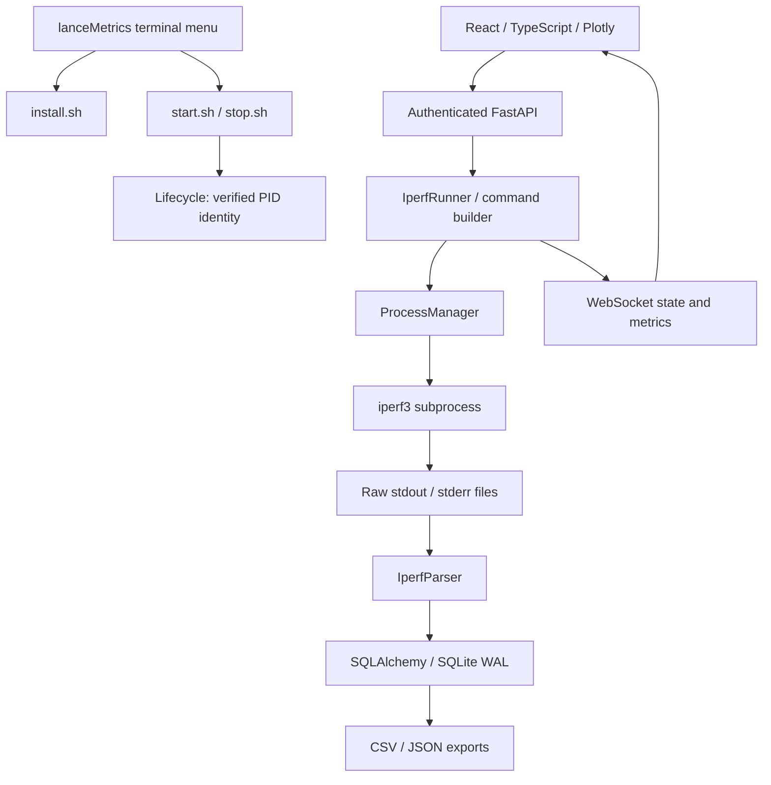

# Architecture

One process serves web assets, REST and WebSocket on port 8080. No separate Node server runs in production. SQLite stores experiment UUID, state, configuration, environment, session metadata, summaries and measurements. Runtime directory may be relocated using `LANCE_ROOT`; source/build paths then follow that root.

Runner owns an asynchronous task per experiment; MVP serializes local client tests to reduce uncontrolled contention. Profiles snapshot their definitions into experiment configuration. Each stage gets a UUID, command arguments, start/finish times and actual elapsed offset. Experimental rates apply per iperf parallel stream. Parser, subprocess management and export logic are separated from HTTP handlers.

Process metadata contains PID, creation time and argv. stop.sh checks all three before signalling. FastAPI shutdown cancels client tasks, terminates owned server/client processes and records state. Recovery marks previously RUNNING database experiments INTERRUPTED. A crash can require stop.sh to remove remaining owned processes before restarting. Multiple uvicorn workers are unsupported.

API requires a generated random access token (run/access.token, mode 0600). WebSocket authenticates through its first message, not URL query parameters. Web stores it only in sessionStorage. Mutating cross-origin requests are refused. All subprocess arguments are validated arrays, with no shell. Local trusted lab networks are the default trust boundary; use TLS and a firewall/reverse proxy for untrusted networks. Token is access control, not transport encryption. Do not expose directly to the public Internet.

Server observations are independent experiments in the destination SQLite database. Raw `extra_data` retains client session identifiers when iperf supplies them; UUID exchange/consolidation is not implemented. No remote control endpoints exist. `ExperimentSynchronizer` defines identity checks for future authenticated peer exchange; `TrafficGenerator` defines the dataset replay extension boundary. Dataset payload generation is not implemented.

Frontend charts export SVG/PNG through local Plotly. Browser print produces a report/PDF without external services or a server PDF engine. Runtime needs no network services; dependency installation requires package repositories.
